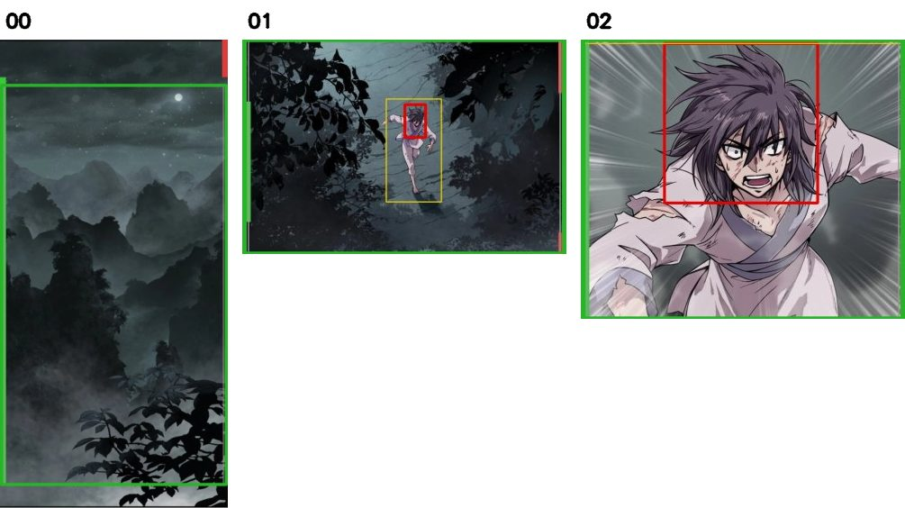
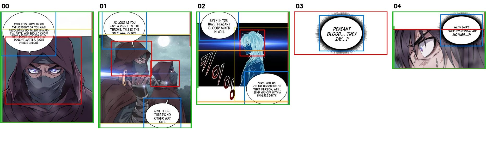
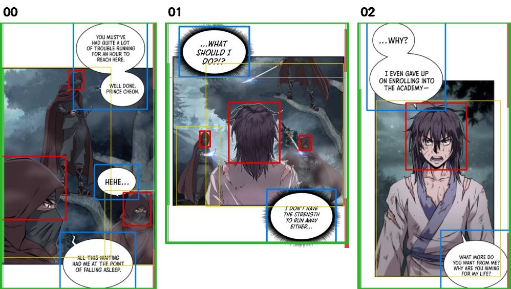
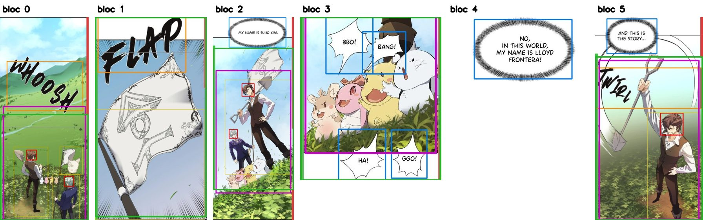
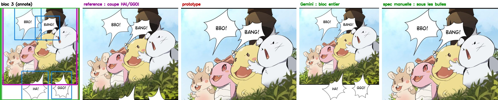
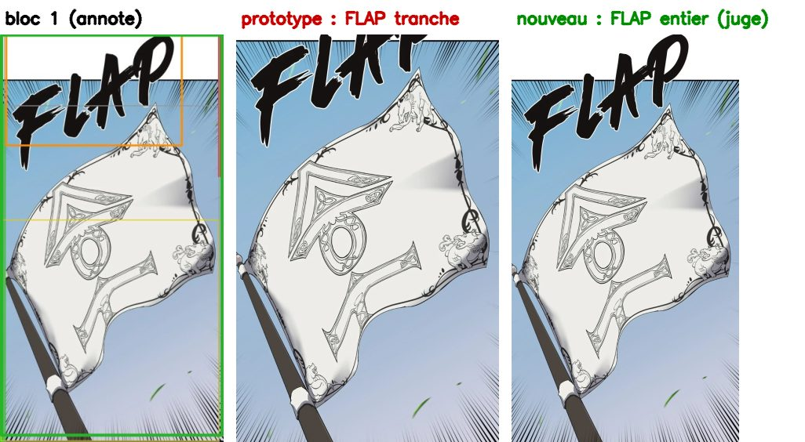
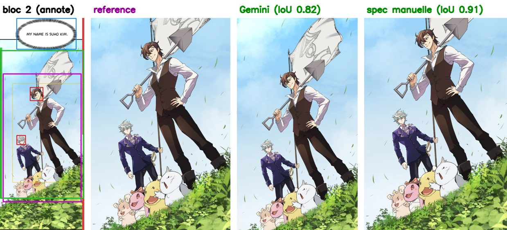
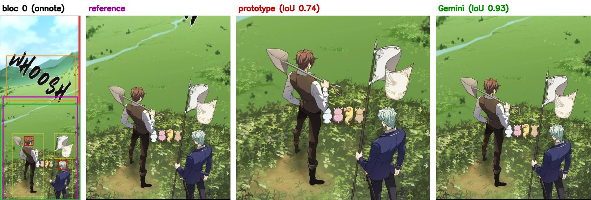

# Rapport toonsplit : découpage intelligent (test sur `001.webp`)

Date : 24/09/2026. Code : `src/modules/toonsplit/`. Jeu de test : `eval/toonsplit/001/` (strip natif 800×11130, 4 crops de référence).

## Mise à jour : Claude par le CLI local, et 3 nouveaux strips

- **Fournisseur par défaut** : Claude, appelé par le CLI Claude Code de la machine (`claude -p`). L'abonnement connecté suffit, sans clé API. Gemini reste disponible avec `--ai gemini`.
- **Isolation de chaque appel** :
  - un seul échange ;
  - le prompt système de toonsplit remplace celui de Claude Code ;
  - aucun outil, aucune session enregistrée ;
  - JSON validé par `--json-schema` ;
  - modèle fixé à `claude-opus-5`.
- **Piège corrigé** : sans `--setting-sources ""`, le CLI injectait ton `CLAUDE.md` global (« Réponds en français ») dans chaque requête. Résultat : des descriptions en français et environ 350 jetons de plus par appel.
- **Nouveaux cas** : `eval/toonsplit/cheon_1..3` (tes 3 strips). Ils n'ont pas de crop de référence, donc on mesure les violations et on relit la planche, mais sans IoU.
- **Coût** : 20 appels pour les 4 strips (17 specs et 3 juges), soit 0,77 $ au tarif API, décompté de l'abonnement.
  - Durée : environ 3,5 min, soit 10 s par appel.
  - Un second passage coûte 0 appel (cache).

| Sur `001` (4 références) | Vallée | Héros | Créatures | Twirl | IoU moyen | Violations dures | SFX tranchées | Appels |
|---|---|---|---|---|---|---|---|---|
| Prototype (avant) | 0,74 | 0,92 | 0,83 | 0,98 | 0,869 | 1 | 1 | 0 |
| Gemini (spec v2) + juge auto | 0,93 | 0,82 | 0,83 | 0,97 | 0,890 | 0 | 0 | 8 |
| **Claude CLI + juge auto** | 0,96 | 0,83 | 0,83 | 0,95 | **0,896** | 0 | 0 | 8 |
| Spec manuelle | 0,96 | 0,91 | 0,82 | 0,98 | 0,918 | 0 | 0 | 0 |

- **Strips `cheon`** : 10 plans, aucune tête, bulle ou onomatopée coupée, aucune narration incluse. Toutes les répliques sont transcrites en anglais, dans l'ordre de lecture, avec un locuteur deviné (une seule réplique « unknown »).
- **La plupart des blocs `cheon` sortent en entier.** Les panneaux sont courts (500 à 1400 px) et leurs bulles chevauchent le bord du panneau. Exclure une bulle rendrait le cadre trop large (ratio au-delà de 1,35) ou couperait la bulle. Le bloc entier est donc le seul plan permis.
- **Vallée plus haute que le cadre (`cheon_1`, bloc 0)** : Claude laisse le brouillard du bas hors de la zone à garder, donc un seul plan suffit.
  - Sans IA, le même bloc devient un `pan` (panoramique vertical).
  - Nouvelle règle : un bloc trop haut ne se coupe en plusieurs plans qu'entre deux zones à garder distinctes. Un paysage continu devient un `pan`, et non deux plans découpés au milieu des montagnes.
- **Échec 1, tête ratée** : l'assassin encapuchonné perché sur la branche (`cheon_3`, bloc 1) n'est pas détecté comme tête.
  - Le candidat « couper le sujet » lui tranchait la tête. Le juge l'a vu et l'a écarté.
  - La métrique « tête coupée » ne peut pas compter ce cas, puisqu'elle repose sur les mêmes détecteurs.
- **Échec 2, faux positif** : le détecteur de têtes prend la bulle hérissée « PEASANT BLOOD... » pour une tête (`cheon_2`, bloc 3). Sans effet ici, car le bloc est du texte seul, sans image.
- **SFX coréen « 키이잉 »** : aucun détecteur ne le trouve. Seule la zone `sfx` donnée par Claude le protège.





*Vert : plan retenu. Rouge : tête. Bleu : bulle. Jaune : personne. Barre gauche : zone à garder. Barre droite : zones à exclure.*

## Personnages seuls (zones jaunes)

- **Commande** : `python -m src.modules.toonsplit figures <strip...>`. Elle écrit une image PNG par personnage, en résolution native, avec `figures.json` et une planche de revue `figures_sheet.jpg`.
- **Sortie** : `output/toonsplit_figures/<cas>/`.
- **Coût** : aucun appel IA, seulement les détecteurs, soit environ 7 s par strip.
- **Règles appliquées à chaque zone** :
  - elle s'agrandit à toute tête qui dépasse, pour ne jamais couper une tête ;
  - une zone sans tête est écartée (ce qui élimine les deux drapeaux pris pour des personnes dans `001`) ;
  - deux zones quasi identiques n'en font qu'une.
- **Résultat** : 15 personnages sur les 4 strips.
- **Par défaut, les bulles qui chevauchent un personnage sont coupées** : c'est la zone jaune prise telle quelle. Avec `--bubbles whole`, la zone s'agrandit aux bulles qu'elle touche, mais elle devient souvent presque tout le panneau. `--margin 0.05` ajoute une marge.
- **Les personnages non humains ne sortent pas** : les créatures de `001` ne sont pas détectées comme « personne ».
- **Les petits personnages restent petits** : le coureur de `cheon_1` fait 137×255 px, car la règle interdit l'agrandissement.

---

## Rapport initial (Gemini, `001`)

## En bref

- **Zéro violation dure** (tête ou bulle coupée) dans toutes les configurations. Le prototype coupait une bulle.
- **Zéro onomatopée tranchée**. Le prototype tranchait FLAP.
- **L'IoU monte de 0,87 à 0,92 avec la spec manuelle**, mais ce gain vient presque entièrement de la préférence 2:3 (règle 3). Sans elle, l'IoU reste à 0,87 (voir l'ablation).
- **Avec Gemini (spec réelle et juge), l'IoU est de 0,89**, pour 8 appels par strip au premier passage et 0 ensuite (cache).
- Aucun paramètre n'a été ajusté sur les 4 crops. Les poids ajoutés sont des valeurs a priori, à valider sur le jeu de 300 à 500 crops.

## Métriques avant / après

Les violations sont mesurées pour toutes les lignes avec les mêmes boîtes (nouveaux détecteurs, résolution native).

| Configuration | Vallée | Héros | Créatures | Twirl | IoU moyen | Têtes coupées | Bulles coupées | SFX tranchées | Appels Gemini |
|---|---|---|---|---|---|---|---|---|---|
| Crops de référence (à la main) | – | – | – | – | – | 0 | **2** | **1** | – |
| **Avant** : prototype (575 px, LBP, spec manuelle) | 0,74 | 0,92 | 0,83 | 0,98 | 0,869 | 0 | **1** | **1** | 0 |
| Nouveau, spec manuelle | 0,96 | 0,91 | 0,82 | 0,98 | **0,918** | 0 | 0 | 0 | 0 |
| Nouveau, spec manuelle, sans préférence 2:3 | 0,74 | 0,92 | 0,82 | 0,98 | 0,865 | 0 | 0 | 0 | 0 |
| Nouveau, sans IA (spec déduite des détections) | 0,96 | 0,76 | 0,83 | 0,90 | 0,866 | 0 | 0 | 0 | 0 |
| **Nouveau, Gemini (spec v2) + juge auto** | 0,93 | 0,82 | 0,83 | 0,97 | **0,890** | 0 | 0 | 0 | 8 puis 0 |

- Violations souples (narration incluse, sujet décentré à plus de 25 %) : 0 partout.
- Déterminisme : un second passage Gemini donne des plans identiques, avec 0 appel.
- Temps : environ 12 s par strip sur CPU, surtout pour les détecteurs. La recherche est vectorisée et prend moins de 0,1 s par bloc.



*Vert : plan retenu. Magenta : référence. Rouge : tête. Bleu : bulle. Orange : onomatopée. Jaune : personne. Barre gauche : zone à garder. Barre droite : zones à exclure.*

## Détecteurs (tâches 1 et 2)

- **Têtes** : `deepghs/anime_head_detection`, modèle `head_detect_v2.0_s` (MIT), seuil de la fiche 0,413.
  - 5 têtes trouvées, dont les **2 vues de dos dans la vallée**. Aucun faux positif sur les 6 blocs.
  - La cascade LBP n'en trouvait aucune à 575 px.
- **Créatures** : aucune tête détectée, car elles ne sont pas humanoïdes. Seule la zone à garder de l'IA les protège.
- **Personnes** : `person_detect_v1.3_s` (MIT). Utilisé en « zone à préférer » seulement, car il donne des faux positifs (hampe du drapeau).
- **Bulles** : union du détecteur classique, du RT-DETR `ogkalu/comic-text-and-bubble-detector` (Apache-2.0) et, en option, du YOLOv8 demandé.
  - Le classique et le RT-DETR trouvent tous deux **7 bulles sur 7**, sans faux positif.
  - Le YOLOv8 n'apporte rien sur ce strip.
- **Onomatopées** : la classe `text_free` du RT-DETR trouve WHOOSH (0,61) et FLAP (0,32), mais rate TWIRL.
  - Une zone `sfx` signalée par Gemini sans détection devient une boîte « tout ou rien ».
- **Pas de `dghs-imgutils`** : il impose `numpy<2` et `opencv-contrib`, ce qui casserait le venv.
  - Les mêmes modèles tournent via `onnxruntime`, avec le pré- et post-traitement d'imgutils reproduits.
- **Licence du YOLOv8** : la fiche dit Apache-2.0, mais les métadonnées de l'ONNX exporté par Ultralytics indiquent AGPL-3.0.
  - Il est donc **désactivé par défaut** (`--bubble-yolo`, fichier dans `models/`, ignoré par git).
  - Ultralytics n'a servi qu'une fois, pour l'export, dans un venv jetable supprimé depuis.

## Gemini (tâches 3 et 4)

- **Spec d'un bloc** : image avec une règle graduée des deux côtés, schéma Pydantic, température 0, graine fixe.
  - Une réponse invalide est redemandée avec l'erreur. Le cache est indexé par le hash du bloc.
  - Les 6 réponses étaient valides du premier coup.
- **Prompt v1 → v2** : la v1 classait BBO!/BANG! comme bulles détachées. La v2 précise qu'une bulle posée sur son locuteur fait partie de la zone à garder.
- **Juge** : il voit une planche numérotée, plus la position et la stratégie de chaque candidat en texte.
  - Sans ce texte, il a inventé un défaut (« le candidat 2 coupe HA!/GGO! », ce qui est faux).
  - En mode `auto`, il n'est appelé qu'en cas de conflit ou quand les deux premiers candidats diffèrent vraiment.
- **Quota** : 18 appels consommés pendant cette session de mise au point.

## Cas d'échec et cas limites

**Créatures : conflit entre les bulles et le sujet.** Le crop de référence coupe HA!/GGO!, ce qui viole la règle 5. Avec la spec manuelle, le plan s'arrête sous les bulles et rogne le bas des corps. Avec Gemini v2, les bulles sont jugées attachées et c'est le bloc entier qui est retenu. Les deux plans respectent les règles, mais l'IoU reste à 0,83, faute de pouvoir reproduire la coupe manuelle.



**Drapeau : FLAP chevauche le haut du drapeau.** L'exclure couperait le drapeau et le trancher viole la règle 6. Le meilleur score tranchait FLAP. La stratégie « onomatopée entière » a proposé une alternative, retenue par le juge. Son ratio de 0,56 est proche de la limite dure de 0,55.



**Héros + groupe : zone à garder trop haute.** Gemini fait commencer le sujet au sommet du drapeau (0,14). Le plan monte donc plus haut que la référence et l'IoU tombe à 0,82 (0,91 avec la spec manuelle).



**Sans IA, le bloc texte seul devient une image.** La narration n'est plus identifiée, donc la métrique « narration incluse » ne peut rien compter.

**Vallée : préférence 2:3.** Le prototype serrait trop le cadre (IoU 0,74). Avec la préférence 2:3, on passe à 0,93-0,96. C'est le seul gros écart d'IoU, et il dépend d'un poids non validé.



## Changements par rapport au prototype

- Tous les calculs se font en résolution native. Les longueurs du prototype sont mises à l'échelle depuis 575 px.
- Les gouttières sont repérées par un score de ressemblance au fond : blanc, noir, couleurs unies, lignes fines qui traversent.
  - Chaque bloc s'étend sur les pointes fines des bulles.
- La recherche est vectorisée : pas de 4 px, puis affinage au pixel. Les fenêtres calées en bas du bloc sont maintenant possibles.
- Couper au bord du bloc, dans la gouttière, ne coûte plus d'énergie.
- Nouveaux termes du score, tous a priori :
  - écart au 2:3 (0,3) ;
  - onomatopée tranchée (0,5) ;
  - personne rognée (0,3) ;
  - onomatopée incluse (1 au lieu de 3).
- Nouveaux candidats concurrents : « garder les bulles », « couper le sujet sous les visages » et « onomatopée entière ». Le juge les départage.
- Blocs trop hauts : plusieurs crops si on peut couper sans trancher une tête, une bulle ou une personne. Sinon, un `pan` (panoramique vertical).
- Mode dégradé : si aucune fenêtre ne respecte les contraintes dures, elles deviennent des pénalités lourdes. On produit toujours une image.

## Limites de cette évaluation

- **4 crops d'une seule série** : les chiffres n'ont aucune valeur statistique.
- **Les violations dures dépendent des détecteurs** : une tête ratée ne peut pas être comptée. La planche HTML sert à la revue humaine.

## Prochaines améliorations proposées

1. **Quota** : envoyer les specs de tous les blocs dans la requête unique du chapitre. Aujourd'hui, avec environ 2 appels par bloc, un chapitre de 80 à 190 blocs dépasse le quota gratuit journalier.
2. **Réglage des poids** : ajuster les poids (2:3, onomatopées, personnes) sur le jeu de 300 à 500 crops, avec une validation croisée par série.
3. **Intégration au pipeline** : brancher le module derrière une option. Il faut d'abord trancher la règle LONG « jamais de recadrage ». Le `pan` est à rendre dans `preview_renderer` et CapCut.
4. **Vérité terrain** : annoter à la main les têtes et bulles d'un sous-ensemble, pour mesurer de vraies violations.
5. **Performance** : mettre en cache les détections par hash du bloc (12 s par strip aujourd'hui).

## Relancer

```powershell
.\.venv\Scripts\python.exe -m src.modules.toonsplit split eval/toonsplit/001/strip.webp        # plans + PNG natifs + debug
.\.venv\Scripts\python.exe -m src.modules.toonsplit eval eval/toonsplit --spec manual --judge never
.\.venv\Scripts\python.exe -m src.modules.toonsplit eval eval/toonsplit                          # Claude CLI + juge auto
.\.venv\Scripts\python.exe -m src.modules.toonsplit eval eval/toonsplit --ai gemini              # Gemini + juge auto
.\.venv\Scripts\python.exe -m src.modules.toonsplit eval eval/toonsplit --claude-model sonnet    # autre modele Claude
.\.venv\Scripts\python.exe eval/toonsplit/prototype/run_proto.py                                  # mesure « avant »
.\.venv\Scripts\python.exe -m src.modules.toonsplit eval eval/toonsplit --spec manual --predictions eval/toonsplit/prototype/baseline_predictions.json
$env:TOONSPLIT_SLOW = "1"; .\.venv\Scripts\python.exe -m pytest -q tests/test_toonsplit_models.py
```

Jeu de référence à venir : un dossier par chapitre contenant `strip.webp` et soit `crops/` (les crops faits à la main, retrouvés automatiquement dans le strip), soit `reference.json`. Planche HTML : `output/toonsplit_eval/<config>/index.html`.
